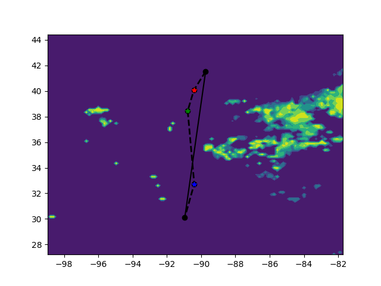
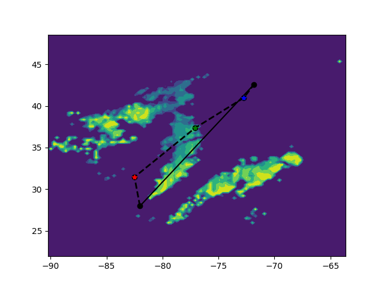
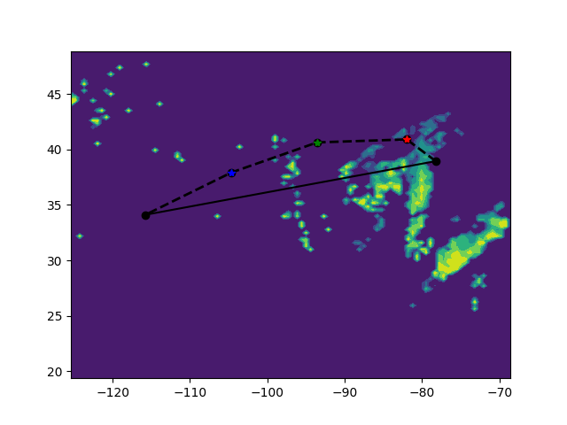

# WeatherCNN
The data generating process has finished as of Oct 17, 2018.
Here listed a few plot of the x train and y train together.

# Data Output
x train is basically a list of 100 by 100 matrix
y train is 1 by 6 which is the coords of three waypoints colored in red, green and blue. 
An additional csv file is used to save start and end waypoint information.
# More 
The dashed line is the trajectory and the solid line is the planned trajectory. 
One can find the start and end point based on the waypoint sequence. 
